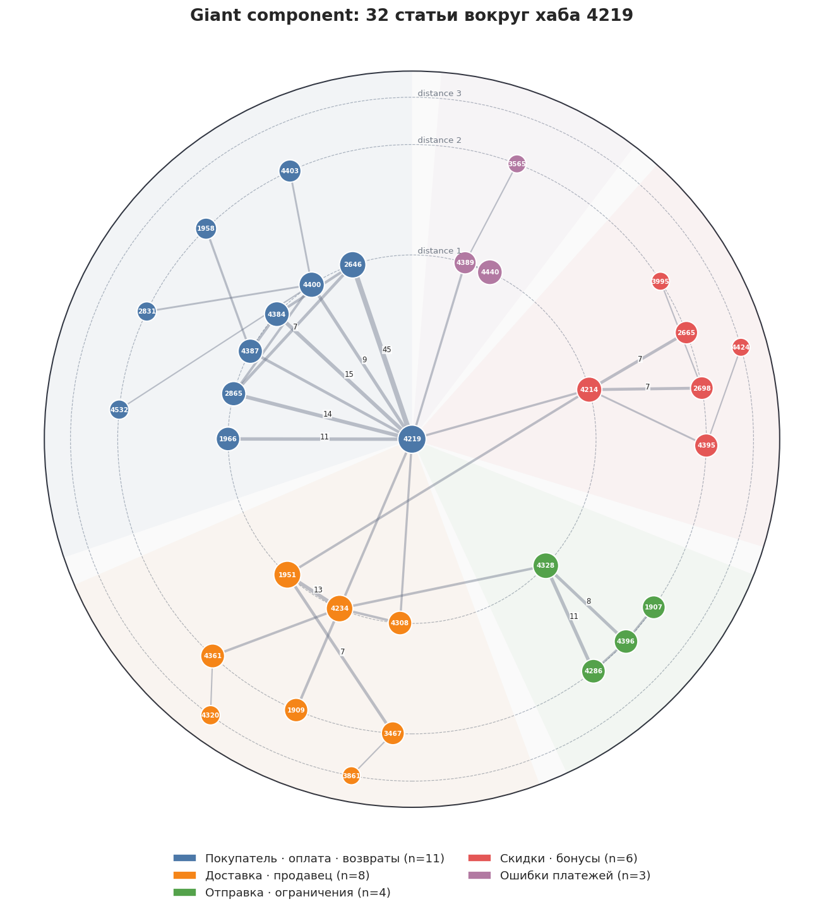
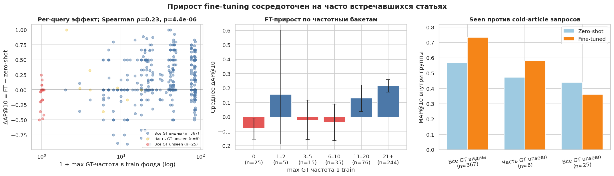
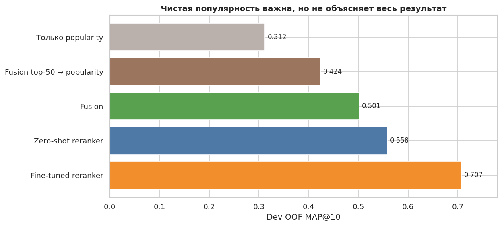

# Поиск статей для ответа на запрос пользователя

_Этот README написан человеком (честно)._

Retrieval-этап RAG-пайплайна: по запросу хотим получать топ-10 релевантных статей, метрика - MAP@10.

Пайплайн: препроцессинг -> статистическое сравнение лексической близости (BM25 + char-TF-IDF) + ретривер статей на основе косинусного расстояния по эмбеддингам (BAAI/bge-m3) -> слияние кандидатов -> cross-encoder реранкеры (BAAI/bge-reranker-v2-m3, с дообучением) -> подсчёт скоров через LR.
___

## Итог

**1. Zero-shot bge-reranker-v2-m3** - не засылался; `artifacts_rr_bge_v2_m3/answers/`

| Ступень | dev OOF MAP@10 | 95% CI | R@10 |
|---|---|---|---|
| BM25 | 0.312 | [0.279, 0.346] | 0.592 |
| char-TF-IDF | 0.224 | [0.195, 0.254] | 0.484 |
| dense (bge-m3) | 0.418 | [0.382, 0.454] | 0.732 |
| fusion (weighted) | 0.501 | [0.465, 0.537] | 0.828 |
| + reranker zero-shot | 0.529 | [0.496, 0.562] | 0.859 |
| + blend (ручной вес) | 0.591 | [0.556, 0.625] | 0.890 |
| **+ blend LR (экспорт)** | **0.585** | [0.551, 0.620] | 0.895 |

**2. Fine-tune на 400 (5 фолдов)** - test MAP@10 **0.695757**; `artifacts_rr_bge_ft_labeled/answers/`
(ретрив-ступени BM25/char/dense - те же, что в таблице 1)

| Ступень | dev OOF MAP@10 | 95% CI | R@10 |
|---|---|---|---|
| fusion (weighted) | 0.501 | [0.465, 0.537] | 0.828 |
| + reranker zero-shot (топ-50 × 3 чанка) | 0.558 | [0.525, 0.591] | 0.900 |
| + fine-tune (5-fold, OOF) | 0.707 | [0.675, 0.738] | 0.945 |
| + blend (ручной вес) | 0.733 | [0.703, 0.764] | 0.958 |
| **+ blend LR (экспорт)** | **0.730** | [0.700, 0.761] | 0.957 |

**3. FT на 400 + граф-фичи (лучшая попытка)** - test MAP@10 **0.709361**; `artifacts_rr_ft_k50_ep3/answers/`

| Ступень | dev OOF MAP@10 | 95% CI | R@10 |
|---|---|---|---|
| fusion (weighted) | 0.506 | [0.470, 0.541] | 0.830 |
| + reranker zero-shot | 0.558 | [0.525, 0.590] | 0.907 |
| + fine-tune (3 эпохи, OOF) | 0.689 | [0.657, 0.722] | 0.943 |
| + blend LR | 0.742 | [0.712, 0.772] | 0.963 |
| **+ граф-фичи (lr_graph, экспорт)** | **0.761** | [0.731, 0.790] | 0.966 |

**4. FT на 500 + граф-фичи** - test MAP@10 **0.698805**; `artifacts_rr_ft_final/answers/`
(фолды нарезаны по всем 500 з., бывший holdout перемещён в train - этот OOF
с dev-400-строками выше напрямую сравнивать будет невалидно)

| Ступень | OOF-500 MAP@10 | 95% CI | R@10 |
|---|---|---|---|
| fusion (weighted) | 0.493 | [0.461, 0.525] | 0.816 |
| + fine-tune (5-fold, OOF-500) | 0.679 | [0.649, 0.707] | 0.937 |
| **+ граф-фичи (lr_graph, экспорт)** | **0.731** | [0.704, 0.758] | 0.954 |

**5. Рефит LR на holdout (mean-of-5)** - test MAP@10 **0.663090**; `experiments/generated/answer.csv`

| Ступень | MAP@10 | 95% CI | R@10 |
|---|---|---|---|
| blend lr_graph, fit на holdout (train-метрика, не OOF!) | 0.714 | [0.650, 0.778] | 0.950 |

Лучший сабмит - FT на 400 + граф-фичи (0.7094). Разрыв OOF - test держится
-0.04…-0.05 - оптимистичность OOF-оценки, о причинах - в "Важных решениях".
___

## Данные

- `articles.f` - 793 статьи (`article_id`, `title`, `body` в HTML; медиана
  ~3.5К символов, максимум 901К).
- `calibration.f` - 500 размеченных запросов (`ground_truth` - 1-4 статьи: 0.56 -
  одна, 0.36 - две, 0.08 - три-четыре); всего 79 уникальных размеченных статей.
- `test.f` - 500 запросов без разметки, для которых вычисляется `answer.csv`.

Запросы короткие (медиана ~10 слов), разговорные, с опечатками и маркерами дат, сумм и т.д.

Статьи разбираются BeautifulSoup (lxml): удаляются только теги (`script/style/input/img/svg/button`), таблицы, спойлеры/вкладки (`<label>`) (статья на 901К символов укорачивается до ~506К).
Текст статей бьётся на чанки по 400 токенов с перекрытием
100, каждый чанк префиксируется заголовком. Для
лексических ретриверов корпус и запросы нормализуются одинаково: токенизация
`razdel`, лемматизация `pymorphy3`, стоп-слова; dense-ветке и реранкерам доступны
чистый текст без лемматизации. Плейсхолдеры в запросах заменяются словами
(`<MONEY>` -> "деньги", `<DATE>` -> "дата", `<PHONE>` -> "телефон", `<URL>` ->
"ссылка", `<ID>` вовсе выбрасываются).
___

## Архитектура (для наилучшего результата)

```
articles.f ──> preprocess ──> corpus / chunks
                                    │
calibration.f ─> make-folds ─> dev 400 (5 фолдов) + holdout 100
                                    │
             retrieve: bm25 │ char_tfidf │ dense (bge-m3) ─> матрицы скоров
                                    │
             fusion (веса по OOF) ─> топ-50 кандидатов на запрос
                                    │
             rerank: bge-reranker-v2-m3 (FT по фолдам; test = mean 5 моделей)
                                    │
             blend: mini-LTR (LR поверх скоров источников + граф-фичи)
                                    │
             answer.csv ─> validate
```

Методология разбиения проекта на составляющие:

- Ступени разбиты по директориям, зависимости
  `data, preprocess, retrievers, fusion, rerank, ranking, export` вертикальные;
  `contracts`/`eval`/`config` - сквозные.
- Данных мало, поэтому стадии обмениваются типизированными артефактами:
  `ScoreMatrix` (query_ids, article_ids, scores) проверяет форму и
  согласованность порядков при загрузке; манифест каждой стадии хранит хэши
  конфига и входных данных, кэш валиден только при их совпадении; answer.csv
  проходит отдельный валидатор против test.f и корпуса статей.
___

## Важные решения

- 100 запросов валидационной выборки были отложены, чтобы уметь +- честно считать метрику локально.
- 400 запросов разбиты на 5 фолдов, запросы вне каждого фолда (OOF) используются как валидационная выборка для всех обучаемых стадий (веса fusion, fine-tune веса реранкера): обучаемые стадии фолда `f` учатся на `train(f)` и оцениваются на `val(f)`.
- взят ансамбль из 5 реранкеров: каждый обучен на train-части своего фолда (320 з.) и скорит его OOF-часть (80 з.); на holdout/test усредняются скоры всех пяти. Здесь даталик, который я заметил поздно, но считаю важным назвать: OOF переиспользуется всеми обучаемыми стадиями (веса fusion, выбор эпох FT, отбор варианта головы), а веса LR-бленда обучены на одиночных OOF-скорах, но применяются к усреднённым - dev-метрика оптимистична и склонна к переобучению.
- финальный шаг (для последнего эксперимента): LR-голова перефитчена на holdout (100 з., `experiments/refit_lr_on_holdout.py`): реранкер-фича при обучении та же, что на test (среднее 5 фолд-моделей, ни одна из них holdout не видела), граф - по всем 500 меткам с leave-one-out. Это устраняет несоответствие признаков fit/predict, но расходует holdout как обучающую выборку (записано в `holdout_log.json`) - честную оценку финальной модели даёт только test.
- Метрики берутся с доверительными интервалами: MAP@10 берётся с bootstrap 95% CI по запросам; ключевые сравнения берутся парным permutation-тестом (p-значения предложены в отчётах).
- Реранкер переставляет только топ-50 кандидатов (OOF recall@50 = 0.98), скор статьи берётся как максимум по топ-3 dense-чанкам.
- Вычисления производились на RTX 3060 с 12 ГБ VRAM, fine-tune bge-реранкера не поместился полностью, поэтому были заморожены эмбеддинги, после для дообучения использовались: listwise softmax-CE по группе `[1 позитив + 7 хард-негативов, выбранных среди лучших по мнению реранкера, но ошибочных статей]`, метод - `AdamW(foreach=False)` (пик обучения 7.3 ГБ); старт 1e-5, сглаживание cosine + warmup 0.1, 3 эпохи.
___

## Воспроизведение:

(в venv я протестировать не успел - работало на системном python, pip --user (торч тяжелый, а места мало, до последнего тянул с сохранением весов))

```bash
python3 -m venv .venv && source .venv/bin/activate
cd solution
pip install -r requirements.txt

make test        # unit + smoke тесты
make baseline    # полный пайплайн на конфиге по умолчанию (zero-shot, без дообучения)

# лучший сабмит (test MAP@10 0.7094): FT top-50, 3 эпохи, граф-фичи:
PYTHONPATH=src HF_HUB_OFFLINE=1 PYTORCH_CUDA_ALLOC_CONF=expandable_segments:True \
  python3 -m support_search.cli all --experiment rerank_ft_k50_ep3.yaml
```

**Веса дообученных реранкеров** - чтобы не обучать 5 фолд-моделей заново
(~3.5 ч GPU), архив `reranker_ft_k50_ep3_weights.tar.gz` (8.4 ГБ, ссылка: https://disk.yandex.ru/d/erVNs0CPf1cWCQ; рядом `.sha256`) распаковать в `solution/`:

```bash
tar -xzf reranker_ft_k50_ep3_weights.tar.gz -C solution/
# веса лягут в solution/artifacts_rr_ft_k50_ep3/models/reranker_ft/fold_{0..4};
# resume_folds: true в конфиге подхватит их, останется только скоринг
```

Без архива команда выше обучит те же 5 фолдов с нуля (FT недетерминирован,
метрика может отличаться в пределах шума сида).

Результат - `<artifacts_dir>/answers/answer.csv`; таблицы метрик -
`<artifacts_dir>/runs/experiments.csv`; отчёты - `runs/*_report.json`.

**Окружение.** ГП - RTX 3060 (12 ГБ). Модели (bge-m3, bge-reranker-v2-m3)
подтягиваются из HuggingFace в кэш при первом запуске, далее `HF_HUB_OFFLINE=1`.
Лемматизация опциональна и подключается автоматически при наличии
`pymorphy3`/`razdel` (иначе - regex-токенизация). numpy зафиксирован на `1.26.4`
(иначе конфликт между `scipy` и `pandas`).
**Тяжёлые артефакты** (индексы, эмбеддинги, веса) в git не хранятся - они
детерминированно (почти, кроме дообучения моделей, я побоялся за OOM и оставил его недетерминированным) пересобираются из данных и конфигов.
**Время** (RTX 3060): лексика + dense + fusion ~1.5 мин; + zero-shot реранк пар ~40 мин; полный fine-tune 5 фолдов ~3.5 ч.
___

## Структура

```
solution/
├── src/support_search/     # библиотека пайплайна
│   ├── contracts/          #   схемы данных + проверки формата
│   ├── data/               #   IO + сплиты (dev/holdout, стратифицированный 5-fold)
│   ├── preprocess/         #   HTML→текст, нормализация/лемматизация, чанкинг
│   ├── retrievers/         #   BM25, char-TF-IDF, dense (bi-encoder) + энкодеры
│   ├── fusion/             #   слияние + OOF-поиск весов + LTR
│   ├── rerank/             #   cross-encoder, сменные backend-ы, обучение
│   ├── ranking/            #   финальный blend / mini-LTR
│   ├── eval/               #   MAP@10, recall@k, bootstrap CI, permutation-тест
│   ├── export/             #   answer.csv + валидация формата
│   └── pipeline/           #   стадии + артефакты/манифесты
├── configs/                # default.yaml + experiments/ (ablation-переопределения)
├── tests/                  # unit + smoke (стаб-энкодеры, без GPU/сети)
├── compare_rerankers.py    # сводная таблица сравнения реранкеров
├── holdout_check.py        # holdout-арбитр перед сабмитом
├── Makefile                # тонкие алиасы над CLI (одна цель - одна стадия)
└── README.md
```

Все параметры - в [`configs/default.yaml`](configs/default.yaml) (секции `data`,
`preprocess`, `folds`, `retrievers`, `fusion`, `reranker`, `ranking`,
`evaluation`, `export`); сиды зафиксированы; ablation-конфиги - в
`configs/experiments/`.
___

## Интересные выводы и эксперименты.

- я рад, что Вы дочитали до этого момента!<br>
- хорошо, что я знаю, как работает гит и могу поставить дату коммита (наверное, частично поэтому вы дочитали до этого). Плохо, что это всё равно после дедлайна + видно время пуша. Я торопился, прошу прощения. Существенно (опечатки убрал и мелкие неточности) дописаны только части с выводами и моими ошибками (сейчас 03:53 20.07.26)

<br>

По получении 0.695 на дообученном реранкере и LR, меня охватил азарт и стало интересно, насколько больше в принципе мне удастся выбить.
Посмотрев на основные ошибки модели, я стал разбирать две основные идеи:
1. Анализ внутренней структуры текстов статей и меток запросов
2. Анализ орфографии и исправления ошибок в запросах

<br>

### 1. Анализ внутренней структуры текстов статей и меток запросов
- очень крутые графики и прилежащая теория! Частично ради того, чтобы видеть вот такое и разбираться с этим, я хочу на стажировку в Авито!

- Размеченные запросы пользователей часто (0.442 от размеченных) имеют >1 статьи. Если представить, что статьи для одного запроса образуют клику, и изобразить это в виде графа, то явно будет прослеживаться гигантская компонента. Она содержит 32 из 79 размеченных статей, 90.6% запросов попадают туда. Для компоненты построено несколько гиперболических графов, но мне трудно сделать сильные выводы на их основе, кроме предложения о добавлении фичей в LR.

<p align="center"></p>

- Декомпозиция FT-прироста по "известности" статьи: на 367 запросах, где все GT-статьи встречались в train-фолде, FT даёт основной прирост. На 25 полностью нетронутых запросах средний эффект отрицательный. При этом суммарно чистый частотный baseline существенно слабее fusion - т.е. FT запоминает и семантический матчинг, и смещение в сторону популярных статей одновременно. В этот момент необходимо сказать, что дальнейшие действия не будут являться попыткой переобучения, если **выполняется условие "хорошести" распределения валидационной выборки**, т.е. **она несёт в себе почти всю информацию об общей природе запросов пользователей** или хотя бы имеет одинаковое распределение с тестовой выборкой.

<p align="center"></p>
<p align="center"></p>

- После размышлений о плотности графа были предложены к использованию следующие фичи:
  - `co_x_margin` - парная фича, предполагается, что она поможет поднять вторую статью к первой, если те часто шли рядом в валидационной выборке.
  - `gt_freq` - явный признак популярности статьи (log1p частоты в GT).
  - `co_top_p` - условная вероятность P(кандидат в GT | лидер топ-3 в GT).
  - `link_top` - та же связь с лидерами топ-3, но по графу HTML-ссылок: не зависит от разметки и покрывает все 793 статьи.
  - `sim_top` - косинусная близость кандидатов к лидерам топ-3 на эмбеддингах (получила почти нулевой скор от LR, что забавно).

- Если присмотреться к текстам статей, то они содержат перекрёстные ссылки. Наложим один граф на другой (1174 направленных ребра на всех 793 статьях): совпали только 19 из 99 рёбер (~24% по весу). Мне это тоже показалось интересным и оно пошло в качестве следующей фичи (`link_top`), но получило вес ~0. Но примечательно, что в этом графе 234 изолированные статьи. Если поверить, что это реальные данные, то хочется сказать, что это материалы по совершенно уникальным случаям, которые не должны сколько-то часто встречаться.
- Ещё раз взглянув на статьи и граф становится понятно, почему синтетический тест показал себя настолько плохо.
- Попытка докинуть дисперсии в финальную голову через использование малой нейросетки не окупилась: listwise MLP [16] на тех же фичах сравнялся с LR (0.761, p ~ 1.0), но он не устойчив относительно разных сидов (0.736–0.750), что говорит о сильном переобучении.

- Итог направления: связка `co_top_p` + `co_x_margin` + `gt_freq` подняла dev OOF бленда 0.742 -> 0.761 (+0.019 на грани значимости: p = 0.05–0.07 в парном permutation-тесте против базового LR) и вместе с выбором 3 эпох FT по свипу дала лучший сабмит: test 0.6958 -> 0.7094. Коэффициенты по отдельности не интерпретируются (по причине природы данных).

<br>

### 2. Анализ орфографии и исправления ошибок в запросах
- Перспективным направлением выглядела попытка исследования исправления орфографии в запросах пользователя. Была идея взять сюда 8B-модель, но так нельзя по правилам контеста, а к меньшим у меня плохое отношение (могут больше испортить данные, чем помочь) (хотя так-то выделение главного слова - интересная мысль). Было предложено сначала научиться "портить" запросы и проверить, что будет с пайплайном: из 9 детерминированных контрфактических преобразований запросов разной степени грубости. По результатам оказалось, что наибольший эффект даёт добавление ошибок в 2 слова, −0.0406 (полная табличка в ноутбуке robustness_error_analysis.ipynb), но я считаю этот эффект слишком слабым, чтобы продолжать действия в сторону только лишь исправления ошибок.

<br>
<br>

- Была попытка разметить редкие статьи через LLM, задав вопросы к каждой и уже на этом датасете проводить FT. Идея с треском провалилась, я получил MAP@10 0.226. Предполагаю, что такое поведение связано с общей природой данных. (+ друг по научке занимался гиперболическими эмбеддингами, он сказал, что почти всегда в сетях можно встретить гигантскую компоненту, что я предположительно и увидел)
- В качестве эмбеддеров я пробовал intfloat/multilingual-e5-large, ai-forever/FRIDA и USER-bge-m3 (дообученный на русском), но остановился на bge-m3
- В качестве реранкеров я пробовал использовать qwen3 0.6B (MAP@10 0.4423 без дообучения) (хорошо, вовремя заметил запись на степике про 1B модели и не стал гонять qwen3 4B и 8B квантованную)
- Вывод, который я хочу сделать: я пока не придумал, как сильно улучшить результат после, предположительно, 0.73 при условии не использования сильно более умных эмбеддеров/реранкеров. Мне очень интересно взглянуть на более сильное решение этой задачи!

___

## Мои ошибки/неточности:

- Наиболее интересным для меня выглядит тот факт, что дообучение на 500 элементах дало худший результат, нежели дообучение на 400 (test 0.6988 против 0.7094). Явной ошибки склейки выборок при проверке не нашлось, поэтому склоняюсь к двум причинам: (1) гиперпараметры выбирались свипом по OOF на 400 и при перенарезке фолдов могли быть неправильно перенесены - каждая фолд-модель стала учиться на 400 запросах вместо 320, т.е. эффективно "дольше", с риском переобучения под разметку; (2) FT недетерминирован, и разница 0.011 на 500 test-запросах лежит внутри ширины bootstrap-CI (~±0.03) - это может быть шум перенарезки и сидов.
- Стоило более аккуратно применять LR: голова обучалась на одиночных OOF-скорах реранкера, а на test применяется к среднему пяти фолд-моделей - у усреднённого логита скорее всего немного другие мода и дисперсия. Непроверенные варианты: z-нормировка скоров внутри запроса перед LR, обучение головы на leave-one-fold-out среднем четырёх моделей (имитация mean-of-5 без утечки) или ранговая агрегация (mean reciprocal rank) вместо сырых логитов. Попытка №5 (рефит LR на holdout, где фича уже mean-of-5) чинила именно это несоответствие, но 100 запросов для обучения оказалось мало - test показал переобучение.
- Не стоило оставлять написание README на вечер перед дедлайном.
